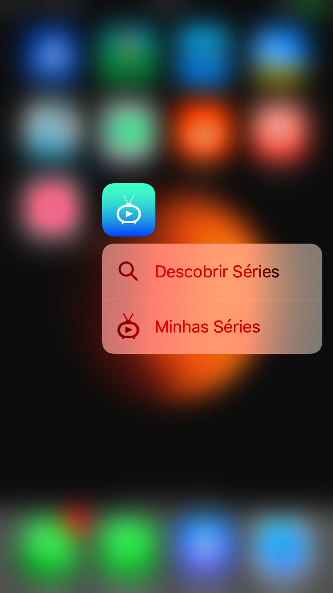

## MyTvShows

This app uses Trakt.tv API to show your Tv Shows.

### ScreenShots
| Images|||
|-----|-----|---|
||||
||||

### DOCS

This applications Uses:

* Cocoapods Libraries
* NAMDatabase: https://github.com/narlei/namdatabase (My Own ORM Open Source project)

### Features
* Show all TV Shows watched in Trakt.tv
* Show all featured TV Shows in Discover Tab
* Find TV Shows
* Mark as Watched and Unwatched
* View watch status 
* Add new TV Shows marking a Episode as watched
* Open Tabs with 3D Touch Quick Actions
* Tv Shows data offline avaliable

###TODO:

O aplicativo, para ser caracterizado como decente precisa ter:

* ~~Uma lista das séries que ele está assistindo no momento~~
* ~~A informação de quantos por cento da séria já foi concluída~~
* ~~Qual o próximo episódio (e a data)~~ (A data não está disponível na API)
* ~~Uma página com as informações dos episódios (só dos próximos, só do último ou de todos fica a seu critério)~~
* ~~Marcar como assistido um episódio~~

Algumas outras funcionalidades que o fariam feliz são:

* Tela do perfil
* ~~Possibilidade de buscar séries~~
* ~~Adicionar uma série na watch list~~ (Assim que adicionado um episódio como assistido, a série é automaticamente adicionada)
* ~~E como bônus, algumas as funcionalidades implementadas podem ser acessíveis offline.~~
